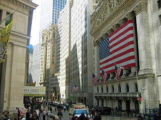
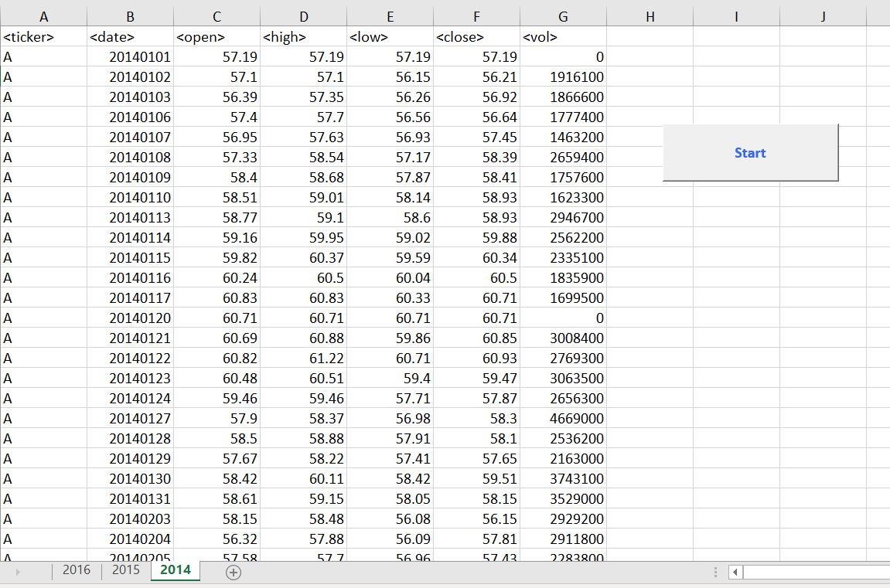
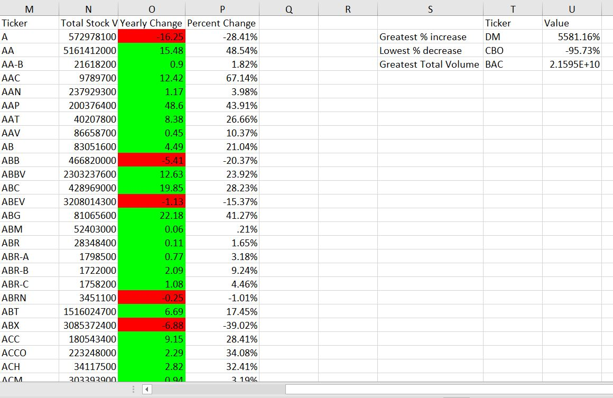

# VBA Wall Street Project

## Background

For this project, we will use VBA scripting to analyze past real stock market data for the 2014-2016 period. 

## Objective

Track performace of stocks for public companies and display results in a simple interface for begginer Excel users.

## Basic Methodology

Script will loop through all the stocks for one year for each run and take the following information.

  * The ticker symbol.

  * Yearly change from opening price at the beginning of a given year to the closing price at the end of that year.

  * The percent change from opening price at the beginning of a given year to the closing price at the end of that year.

  * The total stock volume of the stock.

  * Highlight positive change in green and negative change in red.
 
 The original dataset is over 25 MB and cannot be uploaded to Github. Refer to the "resources" page and access "alphabetical_testing" for reference and also "wall-street" which contains the script itself.

## Overview

The capture above shows a partial view of the workbook. Notice a command button called "Start" has been created to run the script for all spreadsheets. 

Finally, the last capture displays the requirements described on the "Basic Methodology" section. 

## Conclusion 

The app works as intended and runs efficiently with only one script! A possible follow-up to this project could include more features such as graphs to track open and close prices, total stock volume, and percentage increase or decrease over a period of the time.

### Copyright

Arturo Wilson (C) 2020. All Rights Reserved.
